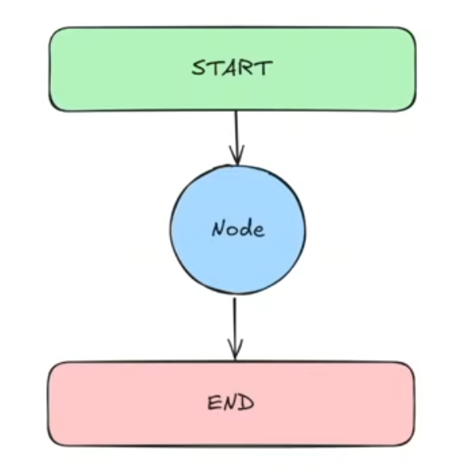

# LangChain_LangGraph_Overview

### Type Annotations

**1. Dictionary**
   - Allows for efficient data retrieval based on unique keys
   - Flexible and easy to implement
   - Leads to challenges in ensuring that the data is a particular structure especially for larger projects
   - Doen't check if hte data is the correct type or structure
  
**2. Typed Dictionary**
   - TypeSaftey: We defined explicitly what the data structure are reducing runtime errors
   - Enchanced Readability: Makes debugging easier and make code more understandable 

**3. Union**
   - Union lets you say that a value can be more than one type
   - Flexible and easy to code
   - Type Saftey as it can provide hints to help catch incorrect usage
  
**4. Optional**
   - In this case "name" can be either String or None!

**5. Any**
   - Anything and Everything Allowed

**6. Lambda Functions**
   - list(map(lambda x:x*x, nums))

### Element 

**1. State**
   - The State is the shared data structure that holds the current information or context of the entire application. 
   - In simple terms, it is like the application's memory, keeping track of the variables and data that nodes can access and modify as they execute
   - **Example**: Whiteboard in Meeting Room 

**2. Node**
   - Nodes are individuals functions or operations that perform specific tasks within the graph. 
   - Each node receive input (often the current state), process it, and produces an output or an updated state
   - **Example**: Assembly line Stations

**3. Graph**
   - A Graph in Langgraph is the overaching structure that maps out how different tasks (nodes )  are connected and executed.
   - It visually represent the workflow, showing the sequence and conditional paths between various various operations.
   - **Example**: Metro Map of Any City

**4. Edges**
   - Edges are the connections between nodes that determine the flow of execution. 
   - They tell us which node should be executed next after the current one completes its task.
   - **Example**: Train Tracks (edges)

**5. Conditional Edges**
   - Conditional Edges are specialized connections that decide the next node to execute based on specific conditions or logic applied to the current state.
   - **Example**: Traffic Lights

**6. START**
   - It is an Virtual Entry Point in LangGraph, marking where the workflow begins.
   - It dosen't perform any operations itself but serves as the designated starting position for the graph's execution.
   - **Example**: Race Starting Line

**7.  END**
   - The END node signifies the conclusion of the workflow in LangGraph.
   - Upon reaching this node, the graph's execution stops, idicating that all intended processes have been completed. 

**8. Tools**
   - Specialized functions or utilities that nodes can utilize to perform specific tasks such as fetching data from an API.
   - Enhances capabilities of nodes by providing additional functionalities.
   - Nodes are part of the graph structure, while tools are functionalities used within nodes
   - **Example**: Tool in a Toolbox

**9. ToolNode**
   -  A ToolNode is just a special Kind of node whose main job is to run a tool.
   -  It connects the tool's output back into the State, so other nodes can use that information.
   - **Example**: Operator Using a Machine

**10. StateGraph**
   - A StateGraph is a Class in Langgraph Used to build and compile the graph structure.
   - It manages the nodes, edges, and the overall state, ensuring that the workflow operates in a unified way and the data flow correctly between the components.
   - **Example**: Blueprint of a Building

**11. Runnable**
   - A Runnable in LangGraph is a Standardized, Executable component that performs a specific tasks within an AI Workflow.
   - It serves as a Fundamental building block, allowing for us to create modular systems.
   - **Example**: LegoBrick (Just like that runnable can be combined together to create complicated AI Workflows.)

### Message Types

**1. Human Message:** Represents input from a user.
**2. System Message:** Used to provide instructions or context to the model
**3. Function Message:** Represents the result of a function call
**4. AI Message:** Represents responses generated by AI models
**5. Tool Message:** Similar to Function Message, but specific to tool usage

## Starting With Agents
| Agent | Level |Graph| Description | Image |
|:-------|:------:|:--------:|:--------:|:------:|
| Hello World| 1 | Hello World Graph | 1. Understand and define the Agent Structure.  2.Create simple node functions to process and Update data. 3.Set up a basic Langgraph structure. 4. Compile and Invoke a Langgraph graph. 5.Understand how data flows through a single-node in Langgraph.|| 

|